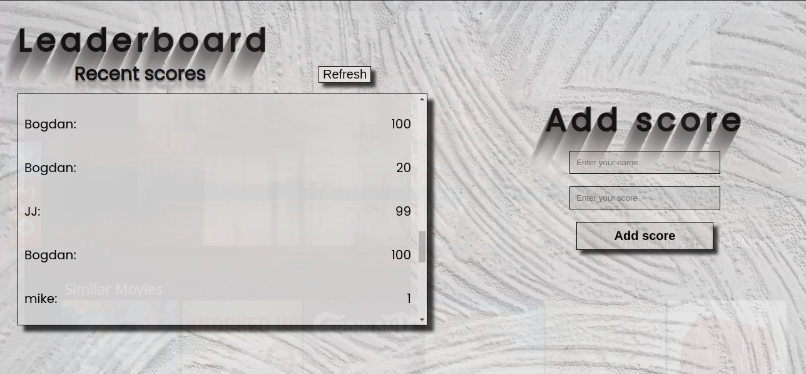

# Leaderboard

> The leaderboard website displays scores submitted by different players. It also allows you to submit your score. All data is preserved thanks to an [external API](https://www.notion.so/Leaderboard-API-service-24c0c3c116974ac49488d4eb0267ade3).

## Built With

- Webpack
- JavaScript (ES6)
- CSS3
- HTML5

## Live Demo
[Click here to view](https://cwaku.github.io/Leaderboard/)

## Getting Started

To get a local copy up and running follow these simple steps.

### Prerequisites

some knowledge on `npm` webpack and ES6

### Setup

- Clone repository using this command in terminal ` git clone https://github.com/cwaku/Leaderboard.git`
- Change directory to the cloned repository `cd Leaderboard`
- Install dependencies using `npm install`
- run `npm start`
### Install

- Node modules
- HtmlWebpackPlugin `npm install --save-dev html-webpack-plugin`
- Load CSS `npm install --save-dev style-loader css-loader`
- Setup local dev server `npm install --save-dev webpack-dev-server`

## Author 👤 

- GitHub: [@cwaku](https://github.com/cwaku)
- LinkedIn: [Ricky Mormor](www.linkedin.com/in/ricky-mormor)
- Instagram: [@rickymormor](https://instagram.com/rickymormor)

## 🤝 Contributing

Contributions, issues, and feature requests are welcome!

Feel free to check the [issues page](https://github.com/cwaku/to-do-list/issues).

## Show your support

Give a ⭐️ if you like this project!
## 📝 License

This project is [MIT](./MIT.md) licensed.
